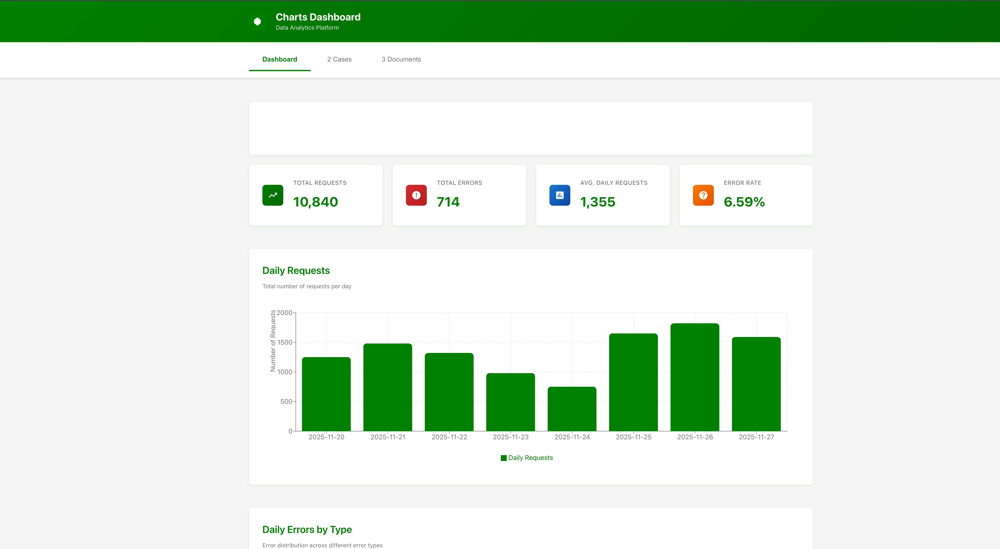

# Charts Dashboard - React Data Visualization Application

A modern, interactive React dashboard for visualizing data with beautiful charts. Features automated Excel data processing and hierarchical classification visualization.

URL: [https://cursor-chart-sample.vercel.app](https://cursor-chart-sample.vercel.app/)




## ✨ Features

### Dashboard Tab
- **Request Analytics**: Daily request count visualization with bar charts
- **Error Tracking**: Daily errors by type with stacked area charts
- **Key Metrics**: Total requests, errors, averages, and error rates

### Cases Tab (Klasse Data)
- **Automated Excel Processing**: Converts `sagKlasseReport.xlsx` to JSON during build
- **Interactive Hierarchical Treemap**: Click to drill down into classifications (01 → 01.00 → 01.00.05)
- **Multiple Visualizations**: Bar charts, pie charts, and treemap for different data dimensions
- **Data Grouping**: 
  - Ejende myndighed (Authorities)
  - Master IT-systemNavn (IT Systems)
  - KleEmne (Classifications - hierarchical)
  - Fremdrift (Progress status)

### General
- **Tab Navigation**: Dashboard, Cases, and Documents sections
- **Responsive Design**: Works on all devices
- **Docker Support**: One-command deployment
- **Green & White Theme**: Clean, professional design

## 📋 Prerequisites

Before you begin, ensure you have the following installed:

- **Node.js** (version 18 or higher)
- **npm** (comes with Node.js)
- **Docker** (optional, for containerized deployment)
- **Docker Compose** (optional, for containerized deployment)

## 🚀 Quick Start

### Local Development

1. **Install dependencies**
   ```bash
   npm install
   ```

2. **Process Excel data** (if you have `data/sagKlasseReport.xlsx`)
   ```bash
   node scripts/processKlasseData.js
   ```

3. **Start development server**
   ```bash
   npm run dev
   ```

4. **Open browser** → `http://localhost:3000`

### Production Build

1. **Build for production** (automatically processes data)
   ```bash
   npm run build
   ```

2. **Preview**
   ```bash
   npm run preview
   ```

### Docker Deployment

1. **Place your Excel file** in the `data/` directory (ignored by git)

2. **Build and start** (automatically processes data during build)
   ```bash
   docker-compose up -d --build
   ```

3. **Open browser** → `http://localhost:8080`

4. **Stop**
   ```bash
   docker-compose down
   ```

## 📁 Project Structure

```
charts-base/
├── data/                      # Excel source files (gitignored)
│   └── sagKlasseReport.xlsx   # Your Excel data file
├── scripts/
│   └── processKlasseData.js   # Excel → JSON processor
├── public/
│   ├── data.json              # Dashboard data
│   └── klasseData.json        # Processed klasse data (generated)
├── src/
│   ├── components/
│   │   ├── charts/
│   │   │   ├── RequestsChart.jsx   # Dashboard bar chart
│   │   │   ├── ErrorsChart.jsx     # Dashboard area chart
│   │   │   ├── KlasseBarChart.jsx  # Klasse bar charts
│   │   │   ├── KlassePieChart.jsx  # Klasse pie chart
│   │   │   └── KlasseTreemap.jsx   # Interactive hierarchical treemap
│   │   ├── Dashboard.jsx      # Dashboard tab
│   │   ├── Cases.jsx          # Klasse data visualizations
│   │   ├── Documents.jsx      # Documents tab (placeholder)
│   │   └── Header.jsx         # App header
│   ├── App.jsx                # Main app
│   └── main.jsx               # Entry point
├── Dockerfile                 # Production Docker image
├── docker-compose.yml         # Docker deployment
└── package.json               # Dependencies
```

## 📊 Data Processing

### Excel Data (Klasse)

The app automatically processes `data/sagKlasseReport.xlsx` during build:

1. **Place Excel file** in `data/sagKlasseReport.xlsx`
2. **Build app** - Excel is automatically converted to JSON
3. **Output** - `public/klasseData.json` is generated

**Expected Excel columns:**
- Column B: Ejende myndighed (Authority)
- Column C: Master IT-systemNavn (IT System)
- Column E: KleEmne (Classification, e.g., "01.00.05")
- Column G: Fremdrift (Progress status)

**Manual processing:**
```bash
node scripts/processKlasseData.js
```

### Dashboard Data

Edit `public/data.json` for dashboard metrics:

```json
{
  "lastImportDate": "2025-11-27T10:30:00Z",
  "dailyRequests": [
    { "date": "2025-11-20", "count": 1250 }
  ],
  "dailyErrors": [
    {
      "date": "2025-11-20",
      "errors": {
        "404 Not Found": 45,
        "500 Server Error": 12
      }
    }
  ]
}
```

## 🛠️ Commands

### Development
```bash
npm install              # Install dependencies
npm run dev              # Start dev server (localhost:3000)
npm run build            # Build for production (processes data)
npm run preview          # Preview production build
npm run lint             # Check code quality
```

### Data Processing
```bash
node scripts/processKlasseData.js   # Process Excel manually
```

### Docker
```bash
docker-compose up -d --build        # Build and start (localhost:8080)
docker-compose logs -f              # View logs
docker-compose down                 # Stop and remove
```

## 🎯 Tech Stack

- **React 18** + **Vite 5**
- **Recharts** (MIT license - bar, pie, area, treemap charts)
- **xlsx** - Excel file processing
- **Nginx** - Production server (Docker)
- **Docker** - Containerized deployment

## 🐛 Troubleshooting

**Port in use:** Change port in `vite.config.js` (dev) or `docker-compose.yml` (production)

**Data not loading:** 
- Run `node scripts/processKlasseData.js` manually
- Check `data/sagKlasseReport.xlsx` exists
- Verify browser console for errors

**Docker build fails:**
- Ensure Excel file is in `data/` directory
- Clear cache: `docker system prune -a`
- Rebuild: `docker-compose up --build`

## 📝 Key Features

### Interactive Treemap
- **Click to drill down**: Explore hierarchical classifications
- **Breadcrumb navigation**: Navigate back through levels
- **Color-coded depths**: Visual hierarchy representation
- **Hover tooltips**: Detailed information on hover

### Automated Data Processing
- Excel → JSON conversion during build
- Hierarchical tree building for classifications
- Aggregated counts at each level
- Top N filtering for performance

---

**Built with ❤️ using React, Vite, and Recharts**

